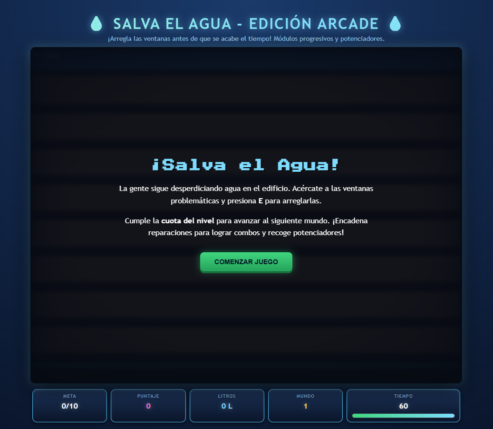
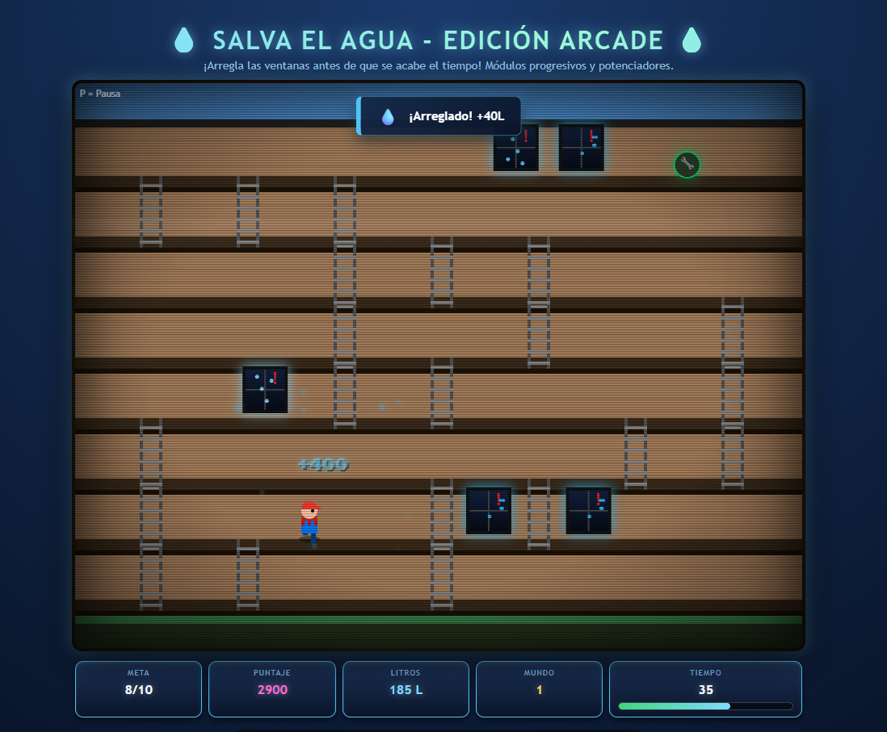
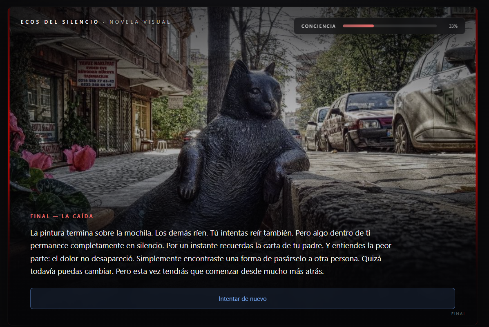
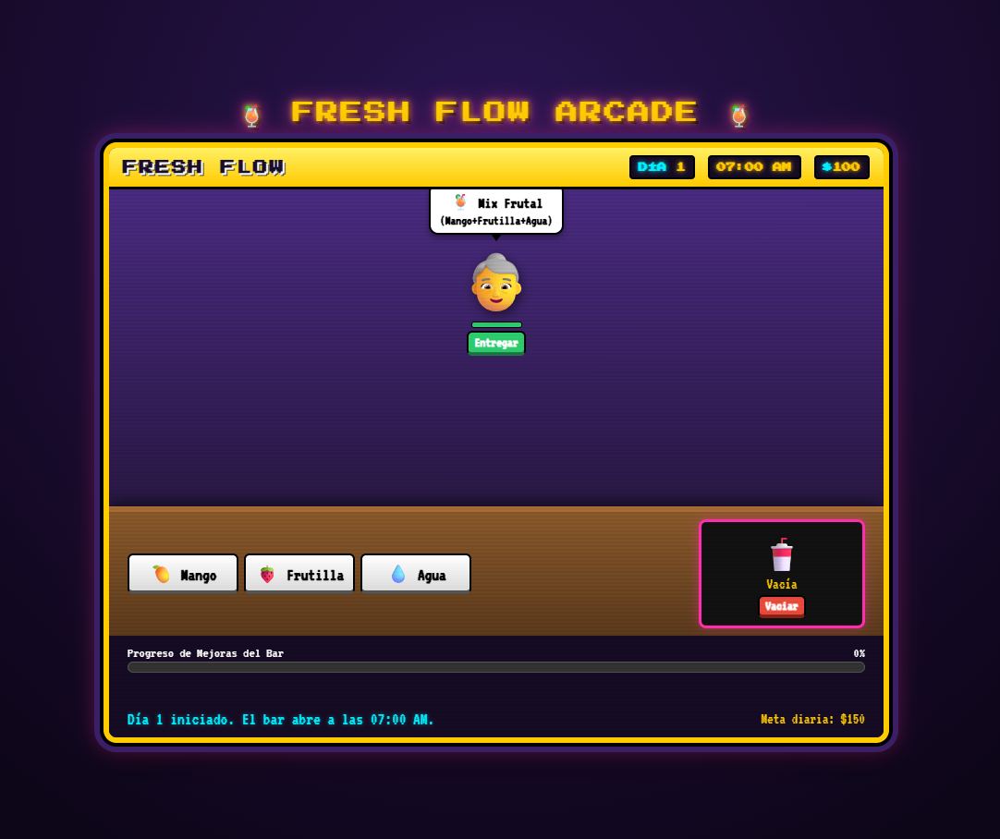
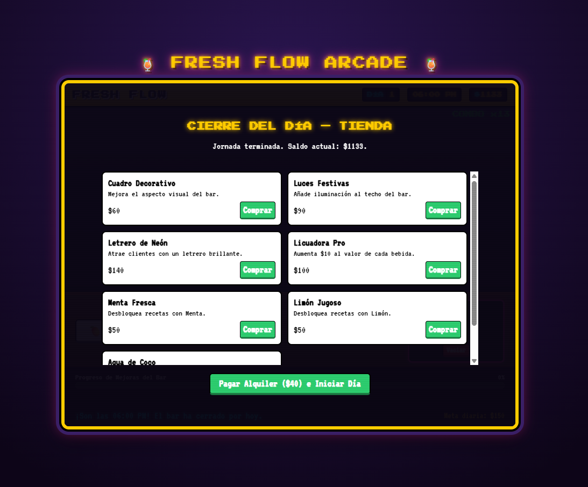
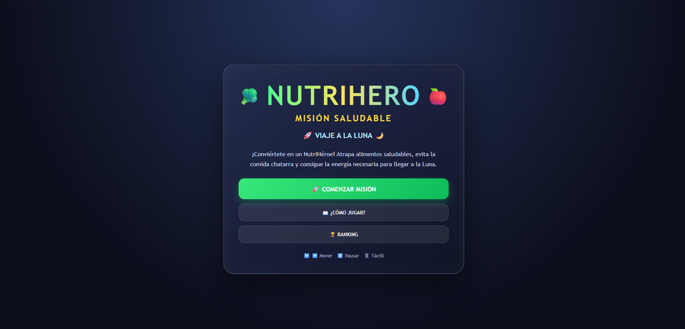
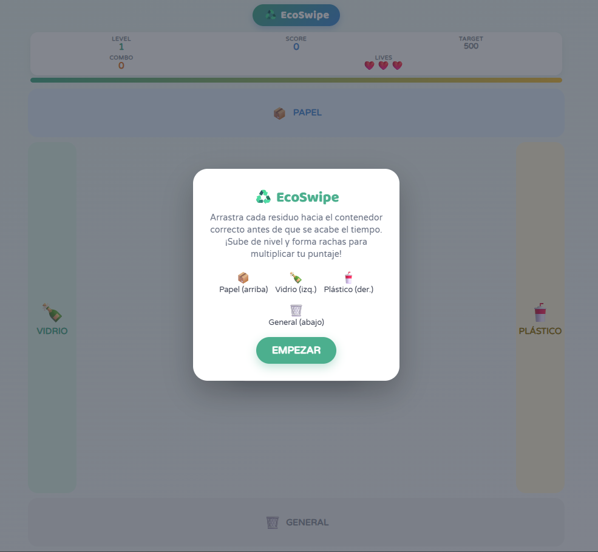

<div align="center">

# 🎮 Colección de Juegos Web Educativos

### Jugá. Aprendé. Repetí. 🌍🧠

[](./LICENSE)
[](https://developer.mozilla.org/en-US/docs/Web/HTML)
[](https://developer.mozilla.org/en-US/docs/Web/CSS)
[](https://developer.mozilla.org/en-US/docs/Web/JavaScript)
[](#)
[](#)

Colección de **mini-juegos web educativos** construidos con **HTML5, CSS3 y JavaScript vainilla puro** — cero frameworks, cero build tools. Cada juego enseña algo distinto: ahorro de agua, convivencia y bullying, reciclaje y alimentación saludable. Todo corre directo en el navegador.

</div>

> ⚠️ **Antes de publicar:** reemplazá `TU-REPO` por el nombre real de tu repositorio en todos los links "▶️ Jugar" — ver la sección [Cómo jugar online](#-cómo-jugar-online).

---

## 📚 Proyectos incluidos

<table>
  <tr>
    <th>Vista previa</th>
    <th>Proyecto</th>
    <th>Género / Temática</th>
    <th>Enlaces</th>
  </tr>
  <tr>
    <td>
      <br/>
      
    </td>
    <td><b>💧 ¡Ahorra el Agua!</b><br/><sub>Edición Arcade</sub></td>
    <td>Plataformas / Arcade<br/><sub>Ahorro de agua</sub></td>
    <td>
      <a href="https://david23444.github.io/TU-REPO/AhorraloRuben/">▶️ Jugar</a><br/>
      <a href="./AhorraloRuben">📂 Código</a>
    </td>
  </tr>
  <tr>
    <td>
      <br/>
      
    </td>
    <td><b>🕯️ Ecos del Silencio</b></td>
    <td>Novela visual<br/><sub>Bullying y duelo</sub></td>
    <td>
      <a href="https://david23444.github.io/TU-REPO/BullyRedention/">▶️ Jugar</a><br/>
      <a href="./BullyRedention">📂 Código</a>
    </td>
  </tr>
  <tr>
    <td>
      <br/>
      
    </td>
    <td><b>🍹 Fresh Flow Arcade</b></td>
    <td>Gestión / Time management<br/><sub>Negocio responsable</sub></td>
    <td>
      <a href="https://david23444.github.io/TU-REPO/FreshLow/">▶️ Jugar</a><br/>
      <a href="./FreshLow">📂 Código</a>
    </td>
  </tr>
  <tr>
    <td>
      
    </td>
    <td><b>🥦 NutriDash</b><br/><sub>Misión Saludable</sub></td>
    <td>Runner de carriles<br/><sub>Alimentación saludable</sub></td>
    <td>
      <a href="https://david23444.github.io/TU-REPO/NutriDash/">▶️ Jugar</a><br/>
      <a href="./NutriDash">📂 Código</a>
    </td>
  </tr>
  <tr>
    <td>
      <br/>
      
    </td>
    <td><b>♻️ EcoRush</b></td>
    <td>Clasificación / Contrarreloj<br/><sub>Reciclaje</sub></td>
    <td>
      <a href="https://david23444.github.io/TU-REPO/EcoRush/">▶️ Jugar</a><br/>
      <a href="./EcoRush">📂 Código</a>
    </td>
  </tr>
</table>

---

## 🕹️ Detalle de cada juego

<details open>
<summary><b>💧 ¡Ahorra el Agua! — Edición Arcade</b></summary>
<br/>

Plataformas estilo *Donkey Kong*: subís escaleras y saltás entre pisos para reparar ventanas y canillas que desperdician agua antes de que se acabe el tiempo.

- Cuota de reparaciones por nivel y combos por reparaciones encadenadas.
- Potenciadores: tiempo extra, velocidad, congelar tiempo, reparación total.
- Tabla de puntajes con ingreso de iniciales estilo arcade.
- Dificultad creciente y fondos temáticos que rotan cada 4 niveles.
</details>

<details>
<summary><b>🕯️ Ecos del Silencio</b></summary>
<br/>

Novela visual sobre un adolescente que, tras la muerte de su padre por acoso laboral, decide si repite o rompe el ciclo de silencio frente al bullying en su entorno.

- 9 decisiones binarias y sistema de "Conciencia" (karma) que define el final.
- Imágenes de fondo generadas dinámicamente por escena, con *fallback* automático.
- Interfaz con estética *glassmorphism*.
</details>

<details>
<summary><b>🍹 Fresh Flow Arcade</b></summary>
<br/>

Gestión de un bar de jugos: combiná ingredientes en una licuadora para cumplir pedidos de clientes con paciencia limitada, y hacé crecer tu negocio.

- Recetas con ingredientes desbloqueables y tienda de mejoras.
- Combos con bono de dinero, eventos aleatorios nocturnos y bancarrota como condición de derrota.
- Sonido generado en tiempo real con Web Audio API.
</details>

<details>
<summary><b>🥦 NutriDash: Misión Saludable</b></summary>
<br/>

Runner de 3 carriles: atrapá alimentos saludables y esquivá comida chatarra en un viaje de la Tierra a la Luna, dividido en 3 niveles.

- Combos, sistema de vidas/energía y preguntas nutricionales de bonus.
- Ranking top 10 persistente en `localStorage`.
- Canvas responsive con controles táctiles.
</details>

<details>
<summary><b>♻️ EcoRush</b></summary>
<br/>

Juego contrarreloj de clasificación de residuos en 4 categorías: papel, plástico, vidrio y orgánico.

- 3 niveles de dificultad creciente (más residuos, menos tiempo).
- Sistema de vidas y puntuación (+100 acierto / -1 vida y -50 puntos error).
- Diseño responsive para escritorio y móvil.
</details>

---

## 🛠️ Stack común

| Tecnología | Uso |
|---|---|
| **HTML5** | Estructura semántica de cada pantalla (menú, tutorial, juego, pausa, resultados) |
| **CSS3** | Estilos, variables, gradientes, animaciones y diseño responsive — sin librerías de UI |
| **JavaScript (vainilla, ES6+)** | Lógica de juego, DOM, canvas, temporizadores — sin frameworks ni build tools |
| **Web Audio API** | Efectos de sonido generados en tiempo real, sin archivos de audio externos |
| **`localStorage`** | Rankings y puntajes persistentes entre sesiones, cuando aplica |

## 🌐 Cómo jugar online

Para que los botones **▶️ Jugar** funcionen de verdad (y no solo muestren el código), activá **GitHub Pages**:

1. En el repo: **Settings → Pages**.
2. En *Branch*, elegí `main` y carpeta `/root` → **Save**.
3. GitHub te da una URL tipo `https://david23444.github.io/TU-REPO/`.
4. Reemplazá `TU-REPO` por ese nombre en todos los links de este README.

Cada juego queda accesible en `https://david23444.github.io/TU-REPO/NOMBRE-CARPETA/`.

## ▶️ Cómo ejecutar en local

```bash
open AhorraloRuben/index.html        # macOS
xdg-open AhorraloRuben/index.html    # Linux
start AhorraloRuben/index.html       # Windows
```

## 📌 Próximos pasos

- [ ] Activar GitHub Pages y reemplazar `TU-REPO` en todos los links.
- [ ] Unificar los juegos bajo una página índice (portfolio) navegable.
- [ ] Agregar rankings compartidos (backend) en los juegos que hoy usan `localStorage`.
- [ ] Sumar capturas de "Inicio" faltantes para NutriDash.

---

<div align="center">

*Colección de proyectos lúdico-educativos sobre sostenibilidad, salud y convivencia, pensados para concientizar mientras se juega.*

</div>
